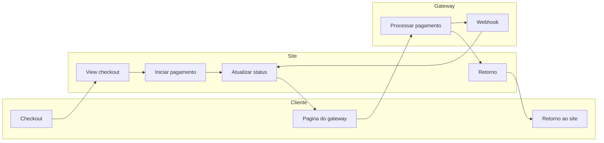

```mermaid
flowchart LR

    %% Cliente
    subgraph Cliente
        C1[Checkout]
        C2[Pagina do gateway]
        C3[Retorno ao site]
    end

    %% Site UrbanRock
    subgraph Site
        CH[View checkout]
        PG_INIT[Iniciar pagamento]
        PG_RETURN[Retorno]
        PG_STATUS[Atualizar status]
    end

    %% Gateway de pagamento
    subgraph Gateway
        GW_PAGE[Processar pagamento]
        GW_WEBHOOK[Webhook]
    end

    %% Fluxo inicial
    C1 --> CH
    CH --> PG_INIT

    %% Criacao do pedido e transacao
    PG_INIT --> PG_STATUS
    PG_STATUS --> C2

    %% Cliente paga no gateway
    C2 --> GW_PAGE

    %% Cliente volta ao site
    GW_PAGE --> PG_RETURN
    PG_RETURN --> C3

    %% Webhook envia status real
    GW_PAGE --> GW_WEBHOOK
    GW_WEBHOOK --> PG_STATUS
```
